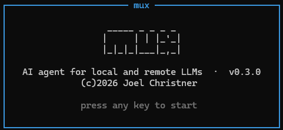
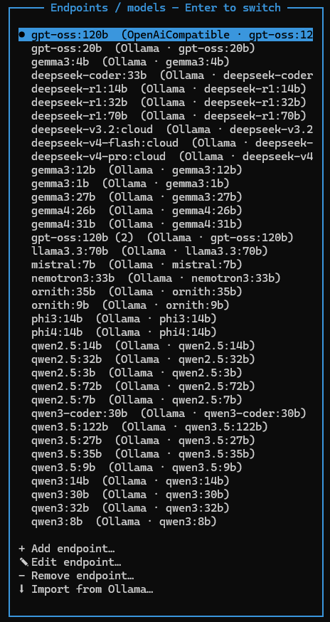
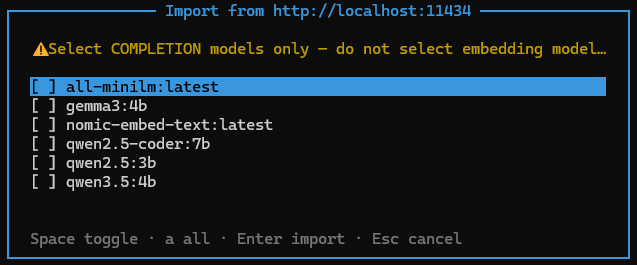
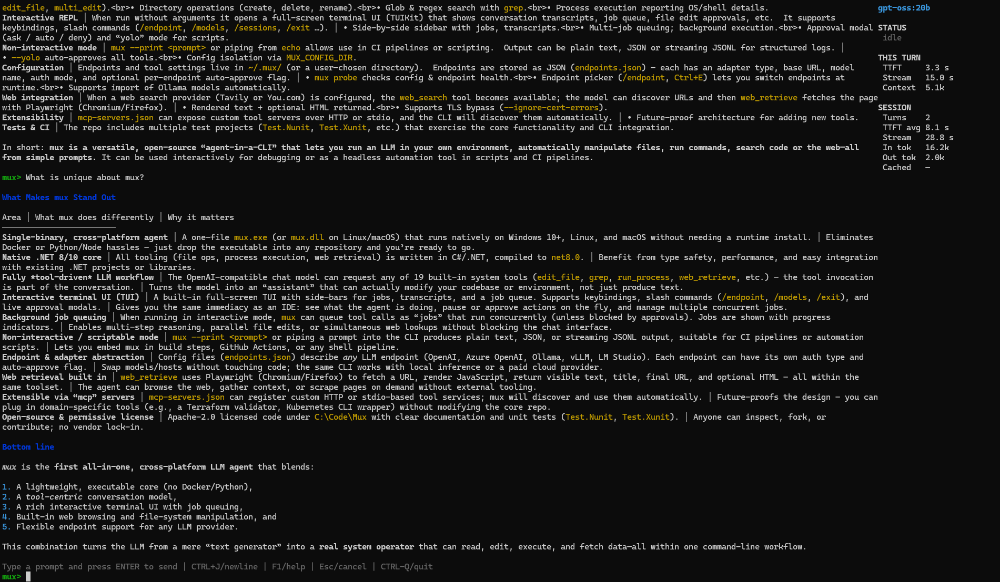
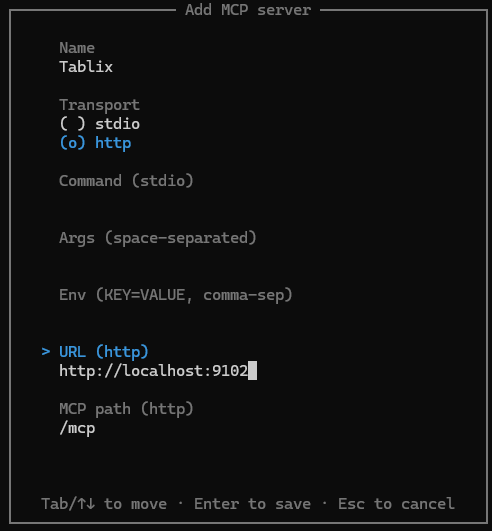
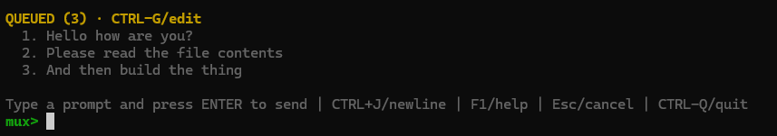
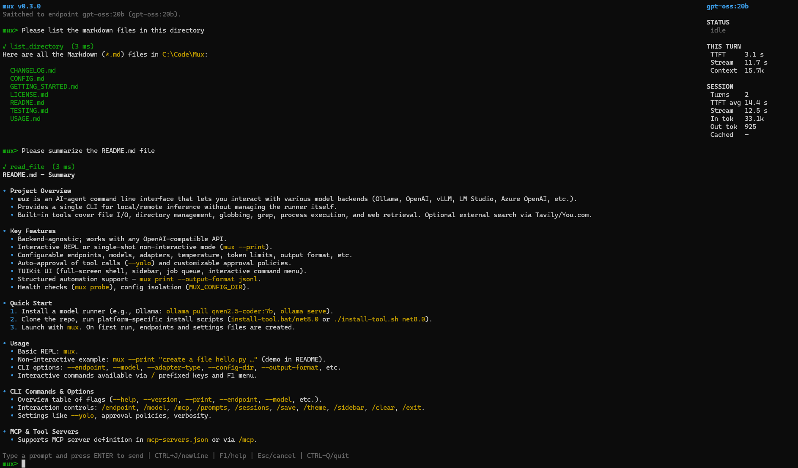
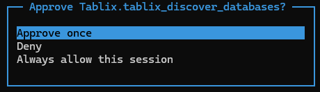
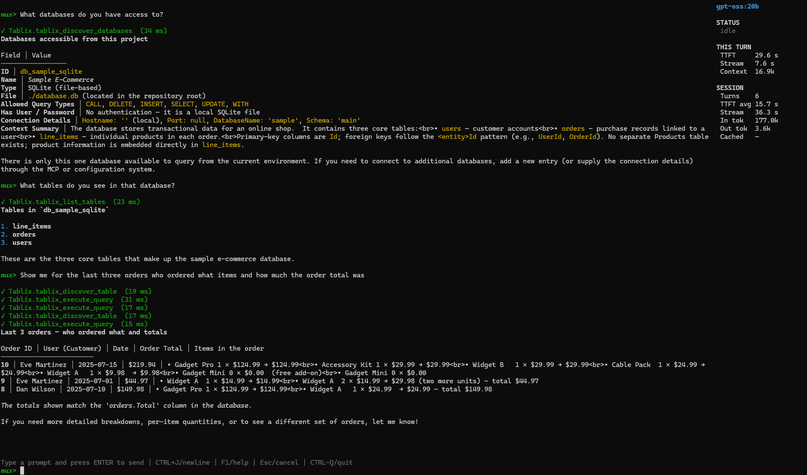

<p align="center">
  <picture>
    <source media="(prefers-color-scheme: dark)" srcset="assets/icon-white.png">
    <source media="(prefers-color-scheme: light)" srcset="assets/icon-black.png">
    
  </picture>
</p>

<h1 align="center">mux</h1>

<p align="center">
  <em>Your AI agent, your models, your infrastructure.</em>
</p>

<p align="center">
  <a href="LICENSE.md"></a>
  <a href="https://dotnet.microsoft.com"></a>
  <a href="CHANGELOG.md"></a>
  <a href="CHANGELOG.md"></a>
</p>

> **Alpha software**
> mux is in alpha. APIs, interfaces, configuration formats, tool schemas, and CLI behavior are all subject to change. Feedback is welcome via [issues](https://github.com/jchristn/Mux/issues) and [discussions](https://github.com/jchristn/Mux/discussions).

## What is mux?

`mux` is a CLI AI agent that gives you a Claude Code / Codex-like experience using the backend and model you choose. It can run against Ollama, OpenAI, vLLM, LM Studio, Azure OpenAI, or any OpenAI-compatible API.

`mux` can read and write files, run commands, search code, and manage a project through either:
- an interactive REPL
- a single-shot non-interactive command surface

`mux` does not install or manage model runners. You bring your own local or remote inference backend, and `mux` connects to it.

## Screenshots

<details>
<summary>Click to expand</summary>

<p align="center"></p>
<p align="center"></p>
<p align="center"></p>
<p align="center"></p>
<p align="center"></p>

**MCP tools**

<p align="center"></p>
<p align="center"></p>
<p align="center"></p>
<p align="center"></p>

</details>

## Highlights

- Backend-agnostic: one CLI for local and remote model runners
- Built-in tools: file edit/read/write/delete, directory management, glob, grep, process execution, and rendered web retrieval
- External web search: optional Tavily and You.com providers expose `web_search` for result discovery
- Shell-aware process execution metadata: `run_process` tells the model which OS and shell it will run under
- MCP tool servers: define `stdio`/HTTP servers in `mcp-servers.json` or manage them with `/mcp`; the interactive UI connects to them, discovers their tools, exposes those tools to the model, and shows per-server connectivity
- Skills: versioned Markdown-plus-code capabilities in `~/.mux/skills` that turn a request into a fixed, deterministic procedure; author, inventory, and manage them in-app with `/skills` (or the `mux skill` verb), and a curated default set ships on first run
- TUIKit interactive UI (`v0.3.0`): a full-screen shell with per-job transcripts, a job sidebar, a multi-line composer, slash commands / key bindings / menu over one command catalog, an interactive tool-approval modal, and autosaved resumable sessions. Multiple prompts run as concurrent background jobs (a single-writer lease serializes file edits); enqueue-while-busy lets you start a new job or append to the focused one. See `USAGE.md`.
- Background tasks: for a large request the model lays out the work as a tracked plan of tasks and advances them as it goes; the interactive shell draws a live checklist that updates in place (pending → running → done), the sidebar shows `TASKS n/m`, `/tasks` opens a viewer to inspect and hand-annotate the plan, and the plan persists across save/resume. A `task_plan_updated` event is emitted in `jsonl` mode for orchestrators. See `USAGE.md`
- Structured automation support: `mux print --output-format jsonl` emits one machine-readable event per line
- Config isolation: set `MUX_CONFIG_DIR` to run with a fully isolated config directory
- Health checks: `mux probe` validates config, backend reachability, auth, and model access

## Quick Start

Prerequisites:
- .NET 8 SDK or later
- A model runner installed and running separately

Example with Ollama:

```bash
ollama pull qwen2.5-coder:7b
ollama serve
```

Install `mux`:

```bash
git clone https://github.com/jchristn/Mux.git
cd Mux

# Windows
install-tool.bat
install-tool.bat net8.0

# Linux / macOS
chmod +x install-tool.sh
./install-tool.sh
./install-tool.sh net8.0
```

The install scripts accept an optional target framework argument. They default to `net10.0` when a .NET 10 SDK is installed and otherwise fall back to `net8.0`.

Run it:

```bash
mux
```

On first run, `mux` creates `~/.mux/endpoints.json` with a default local Ollama endpoint and `~/.mux/settings.json` with editable defaults. If you want an isolated config instead, set `MUX_CONFIG_DIR` before first launch.

See [GETTING_STARTED.md](GETTING_STARTED.md) for the full walkthrough.

## Verify It Works

After install, try this prompt to confirm the model and tools are working end to end:

```text
mux> create a file called hello.py that prints "hello world", then read it back to verify. if the file already exists, overwrite it. when finished, delete the file.
```

You should see `write_file` and `read_file` tool calls, the file created on disk, and the contents read back.

## CLI Usage

```text
mux [prompt]                         Interactive REPL (default)
mux [OPTIONS] [prompt]               Interactive with overrides
mux --print [OPTIONS] <prompt>       Single-shot mode
echo "prompt" | mux --print          Read prompt from stdin
mux probe [OPTIONS]                  Validate config and backend access
mux endpoint <subcommand> [OPTIONS]  Inspect configured endpoints
```

Use `mux print` as the preferred non-interactive entrypoint in scripts and automation. `--print` remains supported and is convenient for stdin piping. Use `mux endpoint list`/`ls`/`show` when automation needs to inspect stored endpoint configuration without entering the REPL.

### Options

| Option | Short / Alias | Description |
|---|---|---|
| `--help` | `-h`, `/?` | Show help and exit |
| `--version` | `/version` | Show version and exit; bare `mux -v` also prints the version |
| `--print` | `-p` | Single-shot mode |
| `--endpoint <name>` | `-e` | Use a named endpoint |
| `--model <name>` | `-m` | Override model |
| `--base-url <url>` |  | Override base URL |
| `--adapter-type <type>` |  | `ollama`, `openai`, `vllm`, `openai-compatible` |
| `--temperature <float>` |  | Override temperature |
| `--max-tokens <int>` |  | Override max output tokens |
| `--compaction-strategy <mode>` |  | Override compaction strategy: `summary` or `trim` |
| `--config-dir <path>` |  | Override the active config directory |
| `--working-directory <path>` | `-w` | Tool execution directory |
| `--system-prompt <path>` |  | Override system prompt file |
| `--output-last-message <path>` |  | Write only the final assistant response text to a file |
| `--yolo` |  | Auto-approve tool calls |
| `--approval-policy <policy>` |  | interactive: `ask`, `auto`, or `deny`; print/probe: `auto` or `deny` |
| `--output-format <format>` |  | `text`, `json`, or `jsonl` depending on the command |
| `--no-mcp` |  | Interactive only: skip MCP server initialization |
| `--ignore-cert-errors` | `--insecure` | Disable TLS certificate validation for mux-owned network requests |
| `--verbose` | `-v` | Extra progress to stderr in text mode |

### Interactive Commands

Every command is also reachable by key binding and the `F1` menu (one catalog, three surfaces).

```text
/endpoint, /model                 Open the endpoints / models picker (also Ctrl+E)
/endpoints, /models               Aliases for /endpoint
/mcp, /mcp-servers, /servers      Open the MCP servers manager (add / edit / remove)
/skills, /skill                   Open the skills manager (inventory / create / import)
/prompts                          Open the prompt-profile editor (also Ctrl+P)
/sessions                         Browse and resume saved sessions
/tasks                            View and annotate the focused job's task plan
/save                             Save the current session
/theme                            Open the theme selector
/sidebar                          Toggle the sidebar
/borders                          Toggle the boundary lines (off by default)
/mouse                            Toggle mouse capture (on by default)
/menu, /help, /?                  Open the navigable command menu (also F1)
/clear                            Clear the transcript
/exit, /quit, /q                  Quit mux
```

The `/endpoint` picker (also `Ctrl+E`) lists your configured endpoints; pick one to switch the active endpoint for subsequent prompts. The same modal offers **Add**, **Edit**, and **Remove** entries: **Add** and **Edit** run a guided form (adapter, base URL, model, auth mode — `none`, `bearer token`, or `custom headers` — default status, endpoint-scoped tool auto-approval, and optional advanced settings) and probe before saving; **Remove** asks for confirmation and refuses to delete the endpoint active in the current session. All three persist to `endpoints.json`. Endpoints can persist `autoApproveTools: true` so tool calls auto-approve whenever that endpoint is active unless CLI approval flags override it, and can set `maxAgentIterations` (leave it `null` to inherit the global `settings.json` default).

For secret values, the form lets you either store the value directly in `endpoints.json` or store an environment-variable reference. It accepts a bare variable name plus `${VAR}`, `%VAR%`, `$VAR`, and `$env:VAR`, then stores environment references canonically as `${VAR}`. For `ollama`, mux uses Ollama's native API root, so the usual base URL is `http://localhost:11434` (no `/v1`); a trailing `/v1` is tolerated and stripped for this adapter.

Below the configured endpoints (which are separated from the actions by a blank row), the picker also offers **Import from Ollama…** for bulk-importing completion models from a running Ollama server:

1. It prompts for the server's base URL, defaulting to `http://localhost:11434`. A missing scheme is filled in with `http://`, and a trailing `/v1` or slash is stripped so the value matches Ollama's native API root.
2. It queries the server's installed models (`GET /api/tags`) and presents a scrollable multi-select checklist of what it finds. `Space` toggles the highlighted model, `a` toggles all, `Enter` imports the checked models, and `Esc` cancels.
3. Because Ollama's model list does not distinguish completion models from embedding models, **every** installed model is shown with a reminder to select completion models only — leave embedding models (for example `nomic-embed-text`) unchecked.

Any model whose model-plus-endpoint combination is already configured is left out of the checklist, so re-running the import never creates duplicates (the picker's title notes how many were already imported). Each selected model is saved to `endpoints.json` as a new `ollama` endpoint pointing at the normalized base URL, named after the model and de-duplicated against your existing endpoint names, and becomes selectable like any other endpoint.

The `/mcp` command (aliases `/mcp-servers`, `/servers`; also on the `F1` menu under **Model**) opens the MCP servers manager, which edits `mcp-servers.json` through the same modal style as the endpoints picker. Each server row shows a live connectivity glyph — `●` online (with its discovered tool count), `○` offline — followed by the server name and transport detail. The list (separated from the actions by a blank row) sits above a **+ Add MCP server…** entry and, when servers exist, a **- Remove MCP server…** entry; selecting a server row opens its **Edit** form. **Add** and **Edit** run a guided form: a **name**, a **transport** (`stdio` or `http`), and the transport-specific fields — **command**, space-separated **args**, and comma-separated `KEY=VALUE` **env** for `stdio`; **url** and **mcp path** (default `/mcp`) for `http`. The form validates that a `stdio` server has a command and an `http` server has a url. **Remove** asks for confirmation.

Configured MCP servers are connected live: on startup mux connects to each server, queries it for its available tools, and both registers those tools as callable (so the model can invoke them, routed back to the owning server) and appends them to the system prompt so the model is explicitly aware of them. Connectivity is re-validated on a periodic timer, and down servers are periodically retried; the manager's glyphs reflect the current state. Adding, editing, or removing a server through the modal reconnects in the background and takes effect on the next turn — no restart required.

### Skills

A skill is a versioned folder under `~/.mux/skills/<id>/` holding a `SKILL.md` — YAML frontmatter (name, description, when-to-use, mutation posture, tags, and commands) plus a Markdown body — and optional bundled scripts. Each command runs a fenced code block or a bundled script through an allowlisted interpreter (`bash`, `sh`, `pwsh`, `python`, `node`, `dotnet-script`) with a timeout and captured output, so a fuzzy request becomes the same fixed procedure every time. The Markdown carries judgment; the code carries determinism.

On startup mux discovers every skill, lists the enabled ones in the system prompt, and exposes two tools to the model: `skill` (read a skill's instructions and commands) and `run_skill` (execute one command deterministically, returned like `run_process`). A skill's code runs under the approval policy and the workspace write lease, the same posture as `run_process`. Caller arguments are passed to the interpreter as separate argv entries with no shell in between, so shell metacharacters in an argument are delivered literally rather than interpreted. A curated library of 46 default skills — spanning git and GitHub (`git-status-vs-head`, `git-commit`, `git-sync`, `git-stash-manager`, `git-secret-scan`, …), .NET build and quality (`dotnet-build`, `dotnet-test`, `dotnet-format`, `ci-repro`, …), repository hygiene (`todo-scan`, `gitignore-audit`, `line-ending-check`, …), scaffolding (`new-class`, `new-tool`, `new-skill`, …), documentation (`doc-sync`, `adr-new`, …), and developer workflow (`standup-summary`, `release-notes`, `env-report`, `json-validate`, …) — is seeded on first run; on upgrade, mux tops up your `~/.mux/skills` with any newly shipped defaults (tracked in a `.seeded-defaults` manifest) without resurrecting ones you deleted or overwriting your edits.

The `/skills` command (alias `/skill`; also on the `F1` menu under **Model**) opens the manager. The inventory lists each skill with a state glyph — `●` enabled, `○` disabled, `⚠` invalid (the detail view shows why) — its command count, and its tags. Per-skill actions cover view, in-app edit (a near-full-screen `SKILL.md` editor — `Ctrl+S` saves and re-validates, `Esc` cancels), enable/disable, duplicate, and remove; a **+ New skill…** wizard walks you through id, title, description, read-only vs mutating, and interpreter, then writes a working starter skill; and **⬇ Import skill…** brings one in from a local path after validating it. Enable/disable state lives in `~/.mux/skills.json` so toggling never rewrites a hand-edited `SKILL.md`. The same operations are available non-interactively:

```text
mux skill list                       # inventory with validity and enablement
mux skill show <name>                # metadata, commands, and body
mux skill validate [<name>]          # validate one or all; nonzero exit on failure (CI gate)
mux skill run <name> <command> [--arg v ...] [--cwd dir]   # execute deterministically
mux skill new <name>                 # scaffold a skill
mux skill add <path>                 # import from a directory
```

Skills are documented in full in `SKILLS_AUTHORING.md`.

The `/borders` command (aliases `/boundaries`, `/lines`; also on the `F1` menu under **View**) toggles optional dark-grey boundary lines, off by default. When on, the shell draws a horizontal rule above the prompt input, a horizontal rule above the queued-messages strip (when one is shown), and a vertical rule in the gutter to the left of the sidebar. The choice persists to `settings.json` as `showBoundaryLines` (also settable there directly) and is applied on the next launch.

External search is configured in `settings.json` (Tavily or You.com); when at least one enabled provider is fully configured the `web_search` tool is enabled. `web_search` discovers candidate results; fetching the contents of a known URL is handled by `web_retrieve`.

### Background Tasks

When a request is large enough to need more than a couple of steps — porting a pattern across several
files, wiring an endpoint through routing and tests — `mux` lets the model break the work into a plan of
tasks and track it as it goes. The model calls two tools to do this: `plan_tasks` lays out the tasks (each
with a short id, a title, and optional `dependsOn` prerequisites), and `update_task` advances one task's
status as work starts and finishes. You do not call these tools; the model does, and the system prompt
tells it when planning is worth the effort. Task planning is on by default and can be turned off with
`taskPlanningEnabled` in `settings.json`.

In the interactive shell the plan renders as a live checklist inside the transcript, updating in place as
each task moves from pending (`◻`) to running (`◼`) to done (`✔`) — a failed task shows `✗` with the
reason, a blocked one `▦`, a skipped one `⊘`. The sidebar shows overall progress as `TASKS n/m`. Because
the checklist holds its place in the transcript, a task completing several turns later updates the original
line rather than reprinting the list. The plan is saved with the session, so resuming a session shows it
exactly where it stood.

Open `/tasks` (also on the `F1` menu under **View**) to inspect the focused job's plan and annotate it by
hand: `c` marks the selected task complete, `i` marks it in progress, `b` blocked, `k` skipped, `p` pending,
and `n` edits its note. Manual changes apply to the same plan the model edits, so they persist and show up
in the sidebar.

For automation, every plan change is a `task_plan_updated` event in `mux print --output-format jsonl`,
carrying the full task snapshot and what changed, and `run_completed` includes a `taskSummary` tally — so an
orchestrator driving `mux` non-interactively can follow subtask progress the same way it follows tool calls.
An opt-in orchestration engine, `TaskOrchestrator`, runs a task DAG as parallel jobs under the same
single-writer workspace lease that protects concurrent jobs. It is gated by `taskParallelismEnabled`
(default off) and is not yet wired into the interactive shell, so today's interactive experience tracks
one job's plan; the engine is used for programmatic orchestration.

### Interactive Input

Interactive mode works like a chat client. Prompt entry supports multi-line editing and paste. After you press `Enter` the prompt runs; you can keep typing and submitting while a turn is in flight, and those prompts queue to run in order as each turn finishes. The sidebar shows the current status and how many prompts are queued.

Each interactive session also maintains a short conversation title. By default mux asks the current model to revisit that title periodically as the discussion evolves. If you set a title manually with `/title <text>`, mux keeps that title fixed until you change it again.

While idle, `Up` and `Down` recall submitted prompts from the current session. `Shift+Enter` and `Ctrl+Enter` insert a newline so you can compose or paste multi-line prompts before submission.

`Esc` cancels the running turn. If a tool approval is needed, mux shows an approval modal — **Approve once**, **Deny**, or **Always this session** (which auto-approves the rest of the session).

New prompts are checked against the context budget before each run. When a prompt would exceed the usable context budget, mux automatically compacts older persisted history before sending the next model call, using the configured compaction strategy (`summary` uses a summary sidecar pass first and trims only if needed; `trim` stays trim-only). `/clear` clears the transcript.

### Interactive Examples

```text
mux> read README.md and suggest improvements
mux> refactor the UserService class to be async
mux> run the tests and fix failures
mux> retrieve https://example.com and summarize the returned text
mux> search the web for recent mux release notes, then retrieve the most relevant result
```

### Web Search And Retrieval

`mux` exposes two separate web tools when tool calling is enabled for the selected endpoint:

- `web_retrieve` fetches a specific HTTP or HTTPS URL with a headless Playwright browser and returns rendered text, title, final URL, status, content type, and optional HTML. It supports Chromium by default and Firefox by request. If the requested Playwright browser is not installed, mux asks Playwright to install it on demand.
- `web_search` searches the public web through configured external providers and returns structured candidate results with URLs and snippets. Tavily and You.com are supported. The tool is exposed only when external search is enabled and at least one enabled provider is fully configured.

Use `web_search` to discover what exists. Use `web_retrieve` to inspect a selected URL or any URL you already know.

Enterprise TLS inspection can cause errors such as `SELF_SIGNED_CERT_IN_CHAIN` while mux connects to LLM endpoints, calls external search providers, retrieves web pages, or downloads Playwright browsers. Use `--ignore-cert-errors` or its `--insecure` alias to disable TLS certificate validation for mux-owned network requests for that run. The same behavior can be enabled with `settings.json` field `ignoreCertErrors: true` or environment variable `MUX_IGNORE_CERT_ERRORS=1`. mux prints a warning when this mode is active. This does not change TLS behavior for commands launched through `run_process` or for external processes started by MCP servers.

### Single-Shot Examples

```bash
mux print --yolo "read README.md and summarize it"
mux print --yolo --endpoint openai-gpt4o "explain this repository"
echo "refactor AuthService" | mux --print --yolo
```

## Automation Contract

Use `mux print` as the non-interactive entrypoint:

```bash
mux print --output-format jsonl --yolo "implement the feature described in TASK.md"
```

If you need a clean final-response artifact for an orchestrator, add:

```bash
mux print --output-format jsonl --output-last-message result.txt --yolo "implement the feature described in TASK.md"
```

`result.txt` contains only the final assistant response text. If the run fails, mux does not create the file.

In `jsonl` mode:
- all structured events are written to `stdout`
- each line is a complete JSON object
- default human-readable progress output is suppressed
- every event includes `contractVersion`
- `run_started` includes effective non-interactive capability metadata such as `commandName`, `endpointSelectionSource`, `cliOverridesApplied`, built-in tool counts, and MCP support/config status
- `run_started` also includes loop/context metadata such as `maxIterations`, `contextWindow`, `reservedOutputTokens`, `usableInputLimit`, `warningThresholdTokens`, `tokenEstimationRatio`, and `compactionStrategy`
- `run_started` includes `ignoreCertErrors` so consumers can detect whether certificate validation was disabled for mux-owned network requests
- `run_completed` also includes `finalEstimatedTokens` and `compactionCount`
- `error` events keep `code` and also expose `errorCode`, `failureCategory`, and resolved runtime metadata when known

Event types currently emitted:
- `run_started`
- `assistant_text`
- `tool_call_proposed`
- `tool_call_approved`
- `tool_call_completed`
- `heartbeat`
- `context_status`
- `context_compacted`
- `error`
- `run_completed`
- `task_plan_updated`

Default `text` mode for `mux print` remains:
- `stdout`: assistant text
- `stderr`: progress, denial notices, and errors

Exit codes:
- `0`: success
- `1`: config, runtime, backend, or command failure
- `2`: tool call denied

Non-interactive constraints:
- `mux print` and `mux probe` do not load MCP servers
- `--no-mcp` is interactive-only and is rejected in `print` and `probe`
- `--approval-policy ask` is rejected in `print` and `probe`; use `auto` or `--yolo`, or `deny`

## Probe Command

`mux probe` uses the same config resolution path as `mux print` and performs a lightweight backend validation.

Examples:

```bash
mux probe
mux probe --output-format json
mux probe -e openai-gpt4o
mux probe --output-format json --require-tools
```

`probe` verifies:
- endpoint selection and config loading
- backend reachability
- auth/header configuration
- model access through a minimal completion request

Machine-readable `probe` output also includes:
- `contractVersion` for explicit parser compatibility
- effective config/runtime metadata such as `configDirectory`, `endpointSelectionSource`, and `cliOverridesApplied`
- capability data such as `toolsEnabled`, built-in tool counts, and MCP support/config state
- classified failures via `errorCode` and `failureCategory`

Probe-specific option:
- `--probe-prompt <text>` overrides the default confirmation prompt used during backend validation
- `--require-tools` fails when the selected endpoint disables tool calling

## Endpoint Command

`mux endpoint` exposes stored endpoint configuration through a non-interactive CLI surface.

Examples:

```bash
mux endpoint list
mux endpoint ls
mux endpoint list --output-format json
mux endpoint ls --output-format json
mux endpoint show openai-gpt4o
mux endpoint show openai-gpt4o --output-format json
```

`endpoint list` and `endpoint ls` return configured endpoint names. `endpoint show` returns one configured endpoint with secret-like header values redacted, tool-calling capability, and persisted tool-approval mode. Use `--config-dir` when you need to inspect an isolated config directory.

## Configuration

Default config directory:

```text
~/.mux/
```

Override it for isolated or concurrent runs:

```bash
# Bash
export MUX_CONFIG_DIR=/tmp/mux-run-1
export MUX_IGNORE_CERT_ERRORS=1

# PowerShell
$env:MUX_CONFIG_DIR = "C:\\temp\\mux-run-1"
$env:MUX_IGNORE_CERT_ERRORS = "1"
```

Or pass a first-class CLI override:

```bash
mux print --config-dir /tmp/mux-run-1 --output-format jsonl --yolo "run the task"
mux print --ignore-cert-errors --output-format jsonl --yolo "run behind enterprise TLS inspection"
```

When both are set, `--config-dir` wins over `MUX_CONFIG_DIR`.

Main files:
- `endpoints.json`
- `mcp-servers.json`
- `settings.json`
- `system-prompt.md`

See [CONFIG.md](CONFIG.md) for the full reference.

## Documentation

- [GETTING_STARTED.md](GETTING_STARTED.md)
- [USAGE.md](USAGE.md)
- [CONFIG.md](CONFIG.md)
- [SKILLS_AUTHORING.md](SKILLS_AUTHORING.md)
- [ARMADA.md](ARMADA.md)
- [TESTING.md](TESTING.md)
- [CHANGELOG.md](CHANGELOG.md)

## License

[MIT](LICENSE.md)
